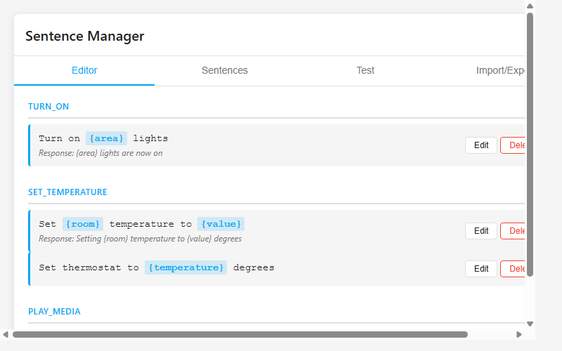
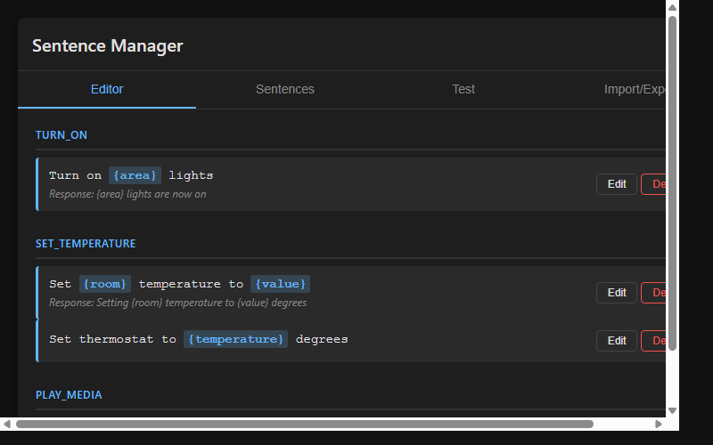

# Home Assistant Sentence Manager

[](https://github.com/MacSiem/ha-sentence-manager/actions/workflows/validate.yml)
[](https://github.com/hacs/integration)

A Lovelace card for Home Assistant that lets you create, manage, and test custom voice sentences for Home Assistant's Assist feature directly from your dashboard.



## Features

- Create and edit custom voice sentences with slot placeholders
- Built-in template library (Lights, Climate, Media, Covers, Locks, Scenes)
- Visual slot highlighting and validation
- Test sentence matching with real-time pattern validation
- Browse and organize sentences by intent
- Import and export sentences as YAML
- Full Home Assistant Assist integration
- Light and dark theme support

## Installation

### HACS (Recommended)

1. Open HACS in your Home Assistant
2. Go to Frontend → Explore & Download Repositories
3. Search for "Sentence Manager"
4. Click Download

### Manual

1. Download `ha-sentence-manager.js` from the [latest release](https://github.com/MacSiem/ha-sentence-manager/releases/latest)
2. Copy it to `/config/www/ha-sentence-manager.js`
3. Add the resource in Settings → Dashboards → Resources:
   - URL: `/local/ha-sentence-manager.js`
   - Type: JavaScript Module

## Usage

Add the card to your dashboard:

```yaml
type: custom:ha-sentence-manager
title: Sentence Manager
language: en
```

### Configuration

| Option | Type | Default | Description |
|--------|------|---------|-------------|
| `title` | string | `Sentence Manager` | Card title |
| `language` | string | `en` | Language code for Assist |

## Screenshots

| Light Theme | Dark Theme |
|:-----------:|:----------:|
|  |  |

## How It Works

The card provides a complete interface for managing Home Assistant Assist custom sentences.

The **Editor tab** lets you create sentences with placeholders like `Turn on {area} lights`. Each sentence maps to an intent name and optional response template. You can add custom slots with types (string, number, area) or use pre-built templates from the library.

The **Sentences tab** displays all created sentences organized by intent, with edit and delete options.

The **Test tab** validates your sentence patterns in real-time. Type a phrase to see which sentences match and what slot values are extracted.

The **Import/Export tab** allows you to back up sentences or share configurations as YAML, compatible with Home Assistant's native sentence format.

## License

MIT License - see [LICENSE](LICENSE) file.
