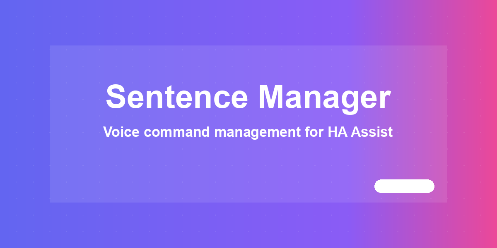

# HA Sentence Manager



Manage Home Assistant Assist custom sentences (intents, slots, responses) from a Lovelace card. Sentences are stored in Home Assistant's official `custom_sentences/<language>/` directory by the bundled Python integration — not in browser storage.

[](https://www.home-assistant.io/) [](LICENSE) [](#changelog)

## Architecture

This repository ships a single HACS integration that bundles two paired components, both maintained by the same author:

| Component | Location | Role |
|---|---|---|
| Python integration | `custom_components/ha_sentence_manager/` | Persists each sentence as one YAML entry under `<config>/custom_sentences/<lang>/ha_sentence_manager_<intent>.yaml` (HA's official location). Exposes a WebSocket API (`ha_sentence_manager/list,create,update,delete,reload`). Triggers `conversation.reload` after every edit. |
| Lovelace card | `custom_components/ha_sentence_manager/www/ha-sentence-manager.js` | Calls the integration's WS API. The integration auto-registers it as a frontend resource on setup, so you don't have to add anything under *Dashboards → Resources*. |

Sentences edited from one device appear on every other device that talks to the same Home Assistant instance, and are included in standard HA backups. The integration assigns each entry a stable opaque id (kept in a sidecar `.meta.yaml` file alongside the main YAML) so renaming or reordering inside the YAML doesn't break id references — and the main YAML stays 100% compatible with HA's `intent_script` schema (no extra keys at the data-entry level).

## Installation (HACS)

1. HACS → Integrations → ⋮ → **Custom repositories**. Add `https://github.com/MacSiem/ha-sentence-manager` with category **Integration**.
2. Install **HA Sentence Manager** and restart Home Assistant.
3. **Settings → Devices & services → Add Integration → HA Sentence Manager**.
4. The Lovelace card is registered automatically. Add it to a dashboard:

   ```yaml
   type: custom:ha-sentence-manager
   ```

No manual `/local/...` resource entry is needed. If you previously installed v4 as a Lovelace plugin, remove the old `/local/community/ha-sentence-manager/ha-sentence-manager.js` resource entry — it's superseded by `/ha_sentence_manager/ha-sentence-manager.js` which the integration serves.

## Features

- Persists Assist sentences in HA's `custom_sentences/<lang>/` directory, the same place HA's conversation integration already reads from.
- Multi-language storage: each sentence lives under its language folder. New sentences default to `hass.config.language` unless you pick another from the card's language filter.
- Runs `conversation.reload` automatically after every create / update / delete so changes take effect immediately.
- Sidecar `.meta.yaml` files keep stable per-entry ids without polluting the main YAML's HA-compatible schema. Hand-edits to the main file are tolerated — ids are regenerated on next read and persisted back.
- Bento Design System (light + dark, mobile-friendly), system font stack — no CDN font fetches, no external network calls.

## Privacy

- All sentence data stays on your Home Assistant instance, written to standard config-directory YAML files (covered by HA's built-in backup).
- The card uses browser `localStorage` only for two UI preferences ("intro dismissed", "tips dismissed") — never for sentence data, which always lives in HA storage.
- No telemetry, no analytics, no CDN-hosted assets, no third-party network calls.

## Upgrade notes (4.x → 5.0)

5.0 is a clean break.

- Sentences saved in browser `localStorage` by 4.x are **not** auto-migrated to the integration. If you have unsaved 4.x data, export it via the "Export" tab in a 4.x instance and re-import the YAML after installing v5.
- The card resource URL changed from `/local/community/ha-sentence-manager/ha-sentence-manager.js` (Lovelace plugin install path) to `/ha_sentence_manager/ha-sentence-manager.js` (integration-served). Remove the old resource entry under *Dashboards → Resources* if you migrated from v4.
- The integration replaces the v4 "auto-detect intents" tab — that path issued real `conversation/process` calls with hardcoded sentences just to enumerate intents, which fired real automations as a side effect. v5 reads what's persisted directly from the integration.

## Changelog

See [CHANGELOG.md](CHANGELOG.md).

## License

MIT — see [LICENSE](LICENSE).
