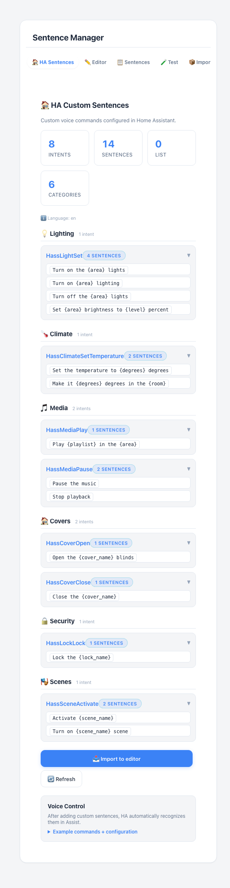
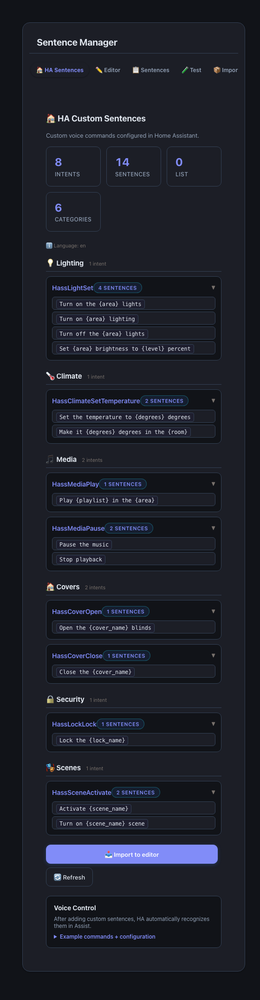

# HA Sentence Manager


Manage Home Assistant Assist custom sentences (intents, slots, responses) from a Lovelace card. Sentences are persisted server-side in Home Assistant's official `custom_sentences/<language>/` directory by a bundled Python integration — not in browser storage.

[](https://www.home-assistant.io/) [](LICENSE) [](https://github.com/MacSiem/ha-sentence-manager/releases)

## How it works

**Short version: install the integration, add the card, edit sentences.**

1. **Server-side storage.** Every sentence is one entry in a YAML file at `<config>/custom_sentences/<lang>/ha_sentence_manager_<intent>.yaml` — HA's own location for Assist custom sentences, so it's covered by standard HA backups and shared across every browser/device.
2. **The card is bundled and auto-registered.** The integration serves `ha-sentence-manager.js` as a static path and calls `add_extra_js_url` on setup, so `custom:ha-sentence-manager` is available without adding a Lovelace resource entry.
3. **Stable ids without polluting the schema.** Each entry gets an opaque id (`<lang>:<intent>:<hex8>`) tracked in a sidecar `.ha_sentence_manager_<intent>.meta.yaml` file. The main YAML stays a plain HA `custom_sentences` file — no extra keys — so hand-editing it is safe; ids are regenerated and re-synced on the next read if the sidecar is missing or out of step.
4. **Auto-reload.** Every create/update/delete calls `conversation.reload` so edits take effect immediately, without a HA restart.
5. **Read is open, write is admin-only.** The `ha_sentence_manager/list` WebSocket command has no admin requirement, so the card renders and is browsable for every logged-in user. `create` / `update` / `delete` / `reload` are decorated with `@websocket_api.require_admin` because they change HA's conversation configuration on disk.

### What is automatic vs. manual

| Automatic | Manual |
|---|---|
| Card JS registration (no Lovelace resource entry) | Adding the integration once (Settings → Devices & services) |
| Browsing/searching sentences — open to every logged-in user | Creating, editing, and deleting sentences — admin accounts only |
| `conversation.reload` after every create/update/delete | Calling `ha_sentence_manager.reload` manually (e.g. after hand-editing a YAML file) |
| Stable per-entry ids via sidecar `.meta.yaml` files | Testing a phrase against `conversation/process` in the Test tab |

## Screenshots

| Light | Dark |
|---|---|
|  |  |

*The default "HA Sentences" tab: stats (intents, sentences, slot lists, categories) and the persisted sentences grouped by category. Dark mode follows your Home Assistant theme automatically.*

## Installation

1. Open HACS → Integrations → ⋮ → **Custom repositories**. Add `https://github.com/MacSiem/ha-sentence-manager` with category **Integration**.
2. Install **HA Sentence Manager** and **restart Home Assistant**.
3. **Settings → Devices & services → Add Integration → HA Sentence Manager.**
4. The Lovelace card is registered automatically — add it to a dashboard.

If you previously installed v4 as a Lovelace plugin, remove the old `/local/community/ha-sentence-manager/ha-sentence-manager.js` resource entry under *Dashboards → Resources* — it's superseded by the integration-served `/ha_sentence_manager/ha-sentence-manager.js`.

## Quick start

```yaml
type: custom:ha-sentence-manager
```

No options are required.

## Card tabs

| Tab | What it does |
|---|---|
| **HA Sentences** (default) | Reads everything persisted via the integration and groups it by intent and by a guessed category (Lighting, Climate, Media, Covers, Security, Scenes, Other). |
| **Editor** | Form to create or edit a sentence: trigger phrase, intent name, slots, response, with quick-fill templates (Lights, Climate, Media, Covers, Locks, Scenes). |
| **Sentences** | Searchable flat list of every persisted entry with Edit/Delete actions. |
| **Test** | Sends the typed phrase to HA's own `conversation/process` WebSocket command and shows the matched intent and response — a live round-trip through Assist, not a local regex simulation. |
| **Import/Export** | Exports the currently loaded sentences as a YAML text block, or bulk-imports pasted YAML (each parsed row is created individually through the same admin-only `create` command as the Editor tab). |
| **Custom Actions** | A reference table of built-in HA Assist intents plus a form that generates a copy-pasteable automation/sentence YAML snippet. This tab does not read or write anything through the integration — nothing you fill in here is saved. |

## Services

This integration exposes no entities. It registers one service:

| Service | Description |
|---|---|
| `ha_sentence_manager.reload` | Asks the `conversation` integration to reload custom sentence YAML files. Called automatically after every create/update/delete; exposed so it can also be triggered manually, e.g. after editing a YAML file by hand. |

## WebSocket API

Consumed by the bundled card; useful if you're scripting against it directly.

| Command | Access | Description |
|---|---|---|
| `ha_sentence_manager/list` | Any logged-in user | Returns every persisted sentence, each `{id, language, intent, sentences, slots, response}`. Optional `language` filter. |
| `ha_sentence_manager/create` | Admin | Creates an entry from `{language, intent, sentences, slots, response}`, returns `{id}`. |
| `ha_sentence_manager/update` | Admin | Patches `sentences` / `slots` / `response` on `sentence_id` via `patch`, returns `{ok}`. |
| `ha_sentence_manager/delete` | Admin | Removes `sentence_id` (and its file, if it was the last entry), returns `{ok}`. |
| `ha_sentence_manager/reload` | Admin | Triggers `conversation.reload`, returns `{ok}`. |

A persisted entry becomes a plain HA `custom_sentences` YAML file — for example, `ha_sentence_manager/create` with `{language: "en", intent: "HassLightSet", sentences: ["Turn on the {area} lights"], slots: {area: "string"}, response: "{area} lights are now on"}` is written to `custom_sentences/en/ha_sentence_manager_HassLightSet.yaml` as:

```yaml
language: en
intents:
  HassLightSet:
    data:
      - sentences:
          - "Turn on the {area} lights"
        slots:
          area: string
        response: "{area} lights are now on"
```

with a sidecar `.ha_sentence_manager_HassLightSet.meta.yaml` holding the matching `ids` list.

## Upgrade notes (4.x → 5.0)

5.0 is a clean break:

- Sentences saved in browser `localStorage` by 4.x are **not** auto-migrated. Export via the "Export" tab in a 4.x instance first if you need to keep them.
- The card resource URL changed from `/local/community/ha-sentence-manager/ha-sentence-manager.js` to `/ha_sentence_manager/ha-sentence-manager.js`. Remove the old resource entry if migrating from v4.
- v4's "auto-detect intents" path issued real `conversation/process` calls with hardcoded sentences just to enumerate intents — that fired real automations as a side effect. v5's "HA Sentences" tab reads straight from what the integration has persisted instead.

## FAQ

**Can non-admin users see this card?**
Yes. `ha_sentence_manager/list` has no admin requirement, so any logged-in Home Assistant user can browse and search sentences. The `create`, `update`, `delete`, and `reload` WebSocket commands are admin-only — a non-admin who tries to save an edit gets a permission error from Home Assistant. The card itself does not hide the Editor/Delete controls for non-admins; the restriction is enforced by Home Assistant on the request.

**Where are my sentences stored?**
As plain YAML under `<config>/custom_sentences/<language>/`, one file per `(language, intent)` pair — the same location Home Assistant's own Assist reads. They're included in any standard HA config backup.

**Does the "Test" tab really talk to Assist?**
Yes — it calls Home Assistant's built-in `conversation/process` WebSocket command and shows the matched intent and spoken response, so it reflects exactly what saying the phrase to Assist would do.

**Does this send data anywhere?**
No. The bundled JS makes no `fetch`/`XMLHttpRequest`/external calls — everything goes through `hass.callWS` against your own Home Assistant instance. The only outbound links in the UI are the optional Buy Me a Coffee / PayPal buttons, which only fire if you click them. No telemetry, no analytics, no CDN-hosted assets.

**What does the card use browser storage for, then?**
Two UI-only preferences: whether the tip banner has been dismissed, and whether the donation banner has been dismissed. Never for sentence data — that always lives in Home Assistant storage.

## Changelog

See [CHANGELOG.md](CHANGELOG.md).

## Support

If this tool makes your Home Assistant life easier, consider supporting development:

- [Buy Me a Coffee](https://buymeacoffee.com/macsiem)
- [PayPal](https://www.paypal.com/donate/?hosted_button_id=Y967H4PLRBN8W)

## License

MIT — see [LICENSE](LICENSE).
