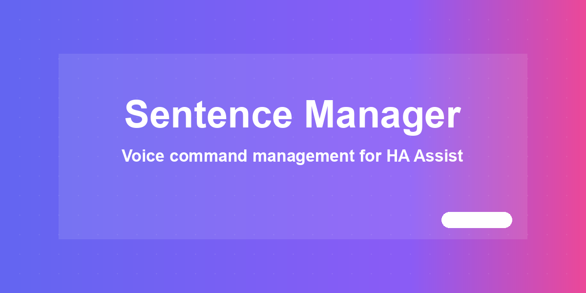
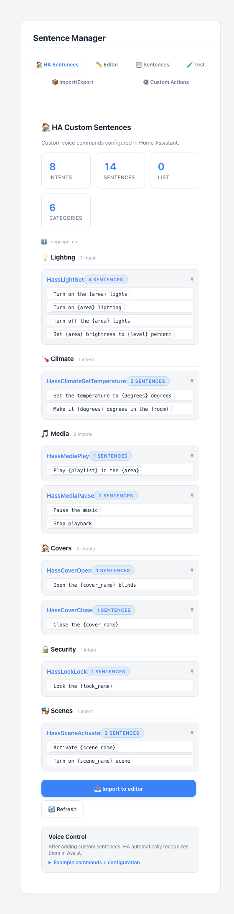
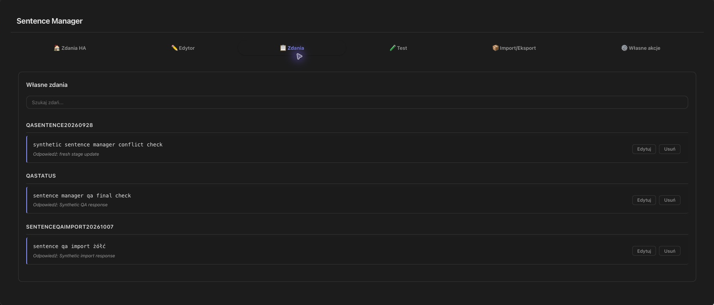

# HA Sentence Manager



Manage Home Assistant Assist custom sentences (intents, slots, responses) from a Lovelace card. Sentences are persisted server-side in Home Assistant's official `custom_sentences/<language>/` directory by a bundled Python integration — not in browser storage.

[](https://www.home-assistant.io/) [](LICENSE) [](https://github.com/MacSiem/ha-sentence-manager/releases)

## How it works

**Short version: install the integration, add the card, edit sentences.**

1. **Server-side storage.** Every sentence is one entry in a YAML file at `<config>/custom_sentences/<lang>/ha_sentence_manager_<intent>.yaml` — HA's own location for Assist custom sentences, so it's covered by standard HA backups and shared across every browser/device.
2. **The card is bundled and auto-registered.** The integration serves `ha-sentence-manager.js`, registers one Lovelace resource in storage mode and an administrator-only sidebar panel. YAML mode uses Home Assistant's frontend fallback.
3. **Stable ids without polluting the schema.** Each entry gets an opaque id tracked in a sidecar `.ha_sentence_manager_<intent>.meta.yaml` file. Keep the YAML and sidecar together in backups. Fingerprints retain IDs for unchanged rows after manual reordering; missing sidecars receive new IDs. Before/after metadata snapshots recover the matching IDs if a write stops before or after the main YAML replacement. The main YAML contains only Home Assistant sentence definitions. Treat IDs as opaque; new IDs also support intent names containing colons, while existing IDs remain valid.
4. **Auto-reload.** After a successful create/update/delete, the card requests `conversation.reload` so edits take effect immediately, without a HA restart.
5. **Read is open, write is admin-only.** The `ha_sentence_manager/list` WebSocket command has no admin requirement, so the card renders and is browsable for every logged-in user. `create` / `update` / `delete` / `reload` are decorated with `@websocket_api.require_admin` because they change HA's conversation configuration on disk.
6. **Concurrent edits are checked.** The card sends the YAML file revision with update/delete requests. If the file changed after you opened the card, the server rejects the stale request so you can reload and review the newer text. Writes use a temporary file and atomic replace, keeping the previous YAML intact if serialization fails.

### What is automatic vs. manual

| Automatic | Manual |
|---|---|
| Card JS registration (one owned resource in storage mode) | Adding the integration once (Settings → Devices & services) |
| Browsing/searching sentences — open to every logged-in user | Creating, editing, and deleting sentences — admin accounts only |
| Card requests `conversation.reload` after a successful create/update/delete | Calling `ha_sentence_manager.reload` manually (e.g. after hand-editing a YAML file) |
| Stable per-entry ids via sidecar `.meta.yaml` files | Testing a phrase against `conversation/process` in the Test tab |

## Screenshots

| Light | Dark |
|---|---|
|  |  |

*The default "HA Sentences" tab with synthetic example phrases: intent,
sentence, slot-list and category counts, grouped by category. Dark mode
follows your Home Assistant theme.*

## Installation

1. Open HACS → Integrations → ⋮ → **Custom repositories**. Add `https://github.com/MacSiem/ha-sentence-manager` with category **Integration**.
2. Install **HA Sentence Manager** and **restart Home Assistant**.
3. **Settings → Devices & services → Add Integration → HA Sentence Manager.**
4. Administrators can open **Sentence Manager** in the sidebar. The Lovelace card is registered automatically — add `type: custom:ha-sentence-manager` to a dashboard if preferred.

If you previously installed v4 as a Lovelace plugin, the integration preserves that existing resource to avoid loading the element twice. To migrate to the bundled card, remove the old `/local/community/ha-sentence-manager/ha-sentence-manager.js` resource entry under *Dashboards → Resources* — it's superseded by the integration-served `/ha_sentence_manager/ha-sentence-manager.js`.

## Upgrade from 5.0.14

Home Assistant 2025.2 or later is required. Back up `custom_sentences/`, including dot-prefixed metadata files, then update the integration through HACS and restart Home Assistant to load the new Python modules. Existing sentence definitions and legacy IDs are retained. Refresh the browser after restart; the owned resource uses a versioned URL. Existing external card resources are preserved and must be migrated explicitly if they still point to an older card.

The server serializes its own executor operations, including writes pending across config-entry reload. Revision checks detect files changed since the last read. They do not provide an atomic compare-and-swap guarantee against an independent process editing files during the check/write interval; avoid simultaneous external file writes. If a stale edit is rejected, reload and review the newer text before saving again.

## Quick start

```yaml
type: custom:ha-sentence-manager
```

No options are required.

## Card tabs

| Tab | What it does |
|---|---|
| **HA Sentences** (default) | Reads everything persisted via the integration and groups it by intent and by a guessed category (Lighting, Climate, Media, Covers, Security, Scenes, Other). |
| **Editor** | Form to create or edit a sentence: trigger phrase, intent name, slots, response, with quick-fill templates (Lights, Climate, Media, Covers, Locks, Scenes). |
| **Sentences** | Searchable flat list of every persisted entry with Edit/Delete actions. |
| **Test** | Sends the typed phrase to HA's own `conversation/process` WebSocket command and shows the matched intent and response — a live round-trip through Assist, not a local regex simulation. |
| **Import/Export** | Exports the currently loaded sentences as a YAML text block, or bulk-imports pasted YAML (each parsed row is created individually through the same admin-only `create` command as the Editor tab). |
| **Custom Actions** | A reference table of built-in HA Assist intents plus a form that generates automation YAML with one or two sentence triggers. Paste the result into the YAML editor of a new HA automation. A service is required; an entity target is optional. Generation and clipboard copying stay in the browser and never call a service or save an automation. Draft edits invalidate the old generated output. |

Import/Export uses the card's `custom_sentences` list format, not an arbitrary Home Assistant configuration file. Exported phrases, responses and slot values preserve quotes and colons when pasted back into Import. The HA Sentences tab separately reads the integration's persisted Assist definitions.

## Services

This integration exposes no entities. It registers one service:

| Service | Description |
|---|---|
| `ha_sentence_manager.reload` | Asks the `conversation` integration to reload custom sentence YAML files. The card requests it after successful mutations. Direct WebSocket scripts must explicitly call reload when finished, as must users editing YAML by hand. |

## WebSocket API

Consumed by the bundled card; useful if you're scripting against it directly.

| Command | Access | Description |
|---|---|---|
| `ha_sentence_manager/list` | Any logged-in user | Returns every persisted sentence, each `{id, language, intent, sentences, slots, response}`. Includes a `revision` digest; optional `language` filter. |
| `ha_sentence_manager/create` | Admin | Creates an entry from `{language, intent, sentences, slots, response}`, returns `{id}`. |
| `ha_sentence_manager/update` | Admin | Patches `sentences` / `slots` / `response` on `sentence_id` via `patch`, with the last-read `revision`; returns `{ok}`. |
| `ha_sentence_manager/delete` | Admin | Removes `sentence_id` using the last-read `revision` (and its file, if it was the last entry); returns `{ok}`. |
| `ha_sentence_manager/reload` | Admin | Triggers `conversation.reload`, returns `{ok}`. |

A persisted entry becomes a plain HA `custom_sentences` YAML file — for example, `ha_sentence_manager/create` with `{language: "en", intent: "HassLightSet", sentences: ["Turn on the {area} lights"], slots: {area: "string"}, response: "{area} lights are now on"}` is written to `custom_sentences/en/ha_sentence_manager_HassLightSet.yaml` as:

```yaml
language: en
intents:
  HassLightSet:
    data:
      - sentences:
          - "Turn on the {area} lights"
        slots:
          area: string
        response: "{area} lights are now on"
```

with a sidecar `.ha_sentence_manager_HassLightSet.meta.yaml` holding the matching `ids` list.

## Upgrade notes (4.x → 5.0)

5.0 is a clean break:

- Sentences saved in browser `localStorage` by 4.x are **not** auto-migrated. Export via the "Export" tab in a 4.x instance first if you need to keep them.
- The card resource URL changed from `/local/community/ha-sentence-manager/ha-sentence-manager.js` to `/ha_sentence_manager/ha-sentence-manager.js`. Remove the old resource entry if migrating from v4.
- v4's "auto-detect intents" path issued real `conversation/process` calls with hardcoded sentences just to enumerate intents — that fired real automations as a side effect. v5's "HA Sentences" tab reads straight from what the integration has persisted instead.

## FAQ

**Can non-admin users see this card?**
Yes. `ha_sentence_manager/list` has no admin requirement, so any logged-in Home Assistant user can browse and search sentences. The `create`, `update`, `delete`, and `reload` WebSocket commands are admin-only — a non-admin who tries to save an edit gets a permission error from Home Assistant. The card hides privileged editor, import and delete controls for non-admins. Home Assistant independently enforces permissions on every mutation request. A role or account change clears the old draft and invalidates pending reads; ordinary language changes preserve drafts, slots, focus and selection.

**Where are my sentences stored?**
As plain YAML under `<config>/custom_sentences/<language>/`, one file per `(language, intent)` pair — the same location Home Assistant's own Assist reads. They're included in any standard HA config backup.

**Does the "Test" tab really talk to Assist?**
Yes — it calls Home Assistant's built-in `conversation/process` WebSocket command and shows the matched intent and spoken response, so it reflects exactly what saying the phrase to Assist would do.

**Does this send data anywhere?**
No. The bundled JS makes no `fetch`/`XMLHttpRequest`/external calls — everything goes through `hass.callWS` against your own Home Assistant instance. The only outbound links in the UI are the optional Buy Me a Coffee / PayPal buttons, which only fire if you click them. No telemetry, no analytics, no CDN-hosted assets.

**What does the card use browser storage for, then?**
Two UI-only preferences: whether the tip banner has been dismissed, and whether the donation banner has been dismissed. Never for sentence data — that always lives in Home Assistant storage.

## Changelog

See [CHANGELOG.md](CHANGELOG.md).

## Support

If this tool makes your Home Assistant life easier, consider supporting development:

- [Buy Me a Coffee](https://buymeacoffee.com/macsiem)
- [PayPal](https://www.paypal.com/donate/?hosted_button_id=Y967H4PLRBN8W)

The card shows a small support link to administrators. It can be dismissed in the browser or hidden with `show_support: false` in the card configuration.

## License

MIT — see [LICENSE](LICENSE).

## Privacy and data

Custom sentences and associated YAML are stored on your Home Assistant server. They can contain entity names and household routines. Back up authored sentences before changes and redact YAML, utterances and entity identifiers before sharing reports.

See [SECURITY.md](SECURITY.md) for safe vulnerability reporting and [NOTICE](NOTICE) for licensing notices.
